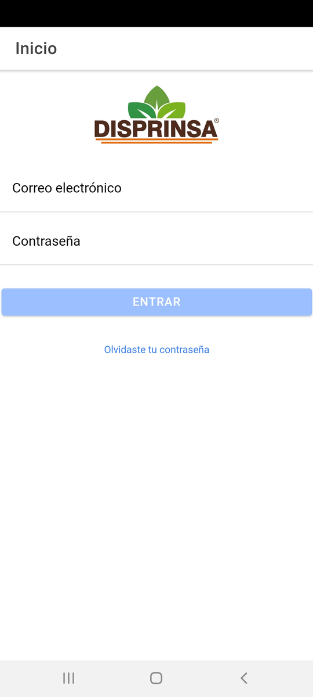
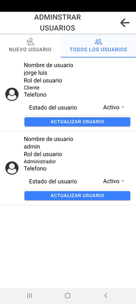

# AppPedidos
Pedidos
Capturas del proyecto
Inicio del sistema

Menu con las opciones de administrador 
-Si es vendedor algunas opciones se ocultan

Agregar usuarios al sistemas con los datos requeridos del sistemas.

Opcion para habilitar o desabilitar el acceso al sistema.

Se verifica los productos dentro del sistema.

